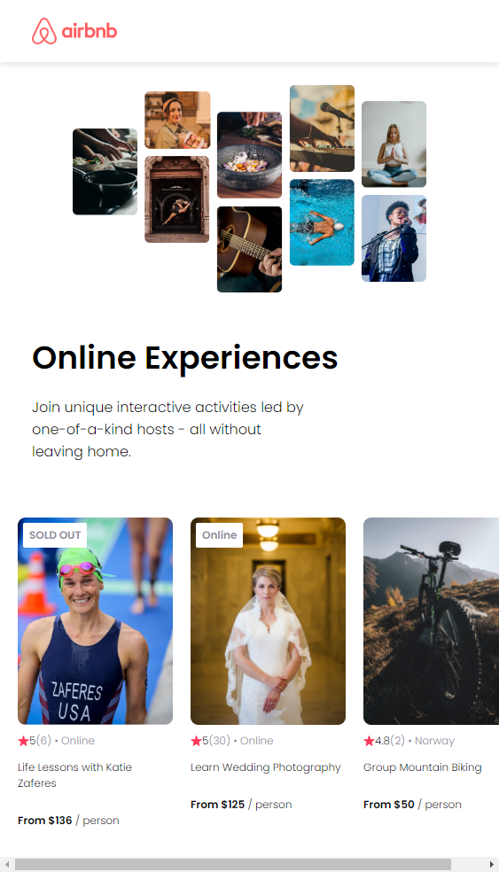

#  AirBnb Experiences Clone

## Objective

Develop an app with static and reusable React components to practice the setup of a React project. This project was created following a tutorial from <a href="https://www.coursera.org/professional-certificates/google-ux-design">Learn React</a> by Bob Ziroll; the design was inspired by <a href="https://www.figma.com/file/4YjrygFEXOcDp9AAnVFv7o/Airbnb-Experiences?type=design&node-id=0-1&mode=design&t=TZKg1cFsJwh7HFnP-0">this</a> Figma prototype.

## Structure

The app consists of three components:
* Navbar
* Hero (hardcoded)
* Card (reusable)

## Learnings

* React Syntax;
* Process of using Create React App;
* Using map to access data;
* Key prop;
* Props: receiving props in a component, destructuring props, passing in non-string props.