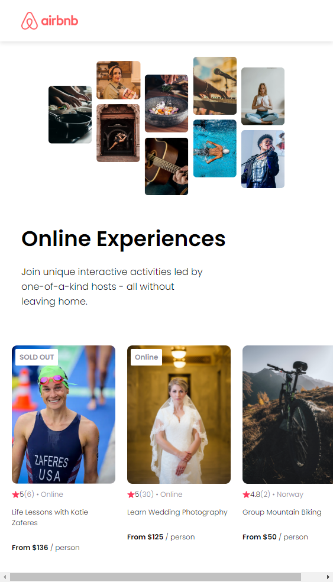

#  Clone do AirBnb Experiences 

## Objetivo

Desenvolver um app com componentes React estáticos e reutilizáveis para praticar a configuração de um projeto React.
Esse projeto foi criado seguindo um tutorial do curso <a href="https://www.coursera.org/professional-certificates/google-ux-design">Learn React</a>, por Bob Ziroll; o design foi inspirado <a href="https://www.figma.com/file/4YjrygFEXOcDp9AAnVFv7o/Airbnb-Experiences?type=design&node-id=0-1&mode=design&t=TZKg1cFsJwh7HFnP-0">neste</a> protótipo do Figma.

## Estrutura

O aplicativo é composto por três componentes:
* Navbar
* Hero (hardcode)
* Card (reutilizável)

## Aprendizados

* Sintaxe do React;
* Processo de uso do Create React App;
* Utilização de map para acessar dados;
* Propriedade key;
* Props: receber props em um componente, desestruturar props, passar props não-string.

## Scripts

No diretório do projeto, execute:

`npm i` para instalar todas as dependências

`npm start` para abrir o projeto no seu navegador
